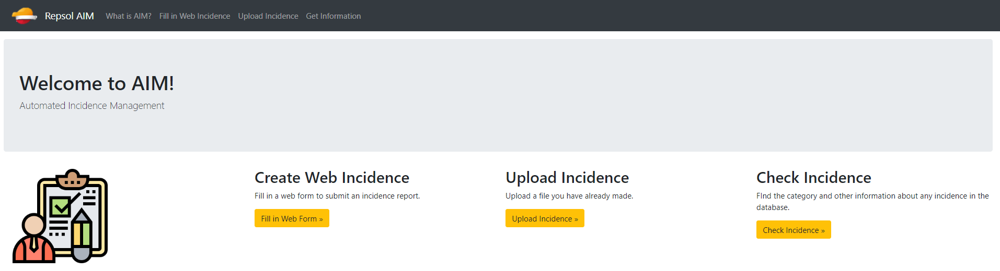

.. Incidences documentation master file, created by
   sphinx-quickstart on Wed Aug 28 11:57:31 2019.
   You can adapt this file completely to your liking, but it should at least
   contain the root `toctree` directive.

Welcome to Project Incidences's documentation!
==============================================

Requirements
+++++++++++++

.. toctree::
   :maxdepth: 2
   :caption: Contents:

   project
   tutorial
   code

Indices and tables
==================

* :ref:`genindex`
* :ref:`modindex`
* :ref:`search`
